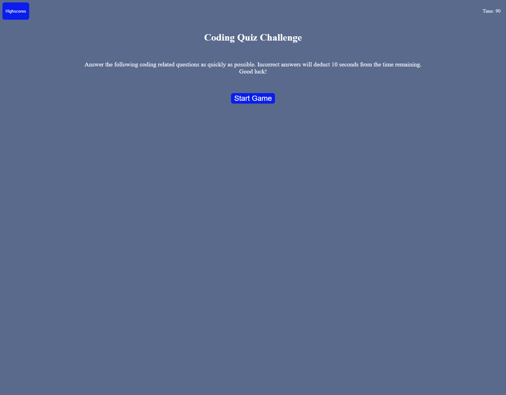

# Coding Quiz Game

This project is a timed coding quiz game. When the user clicks the start button, a series of multiple choice questions are displayed on the page and a timer starts counting down from 90 seconds. As the user clicks on an answer, the answer is checked to see if it's correct. If the user's answer is incorrect 10 seconds are deducted from the remaining time. If the user answers all questions before the timer reaches 0, their remaining time is dislayed as their final score. High scores and names are stored in local storage.

## Link to Deployed Project

https://kmascott.github.io/coding-quiz/

## Screenshot

